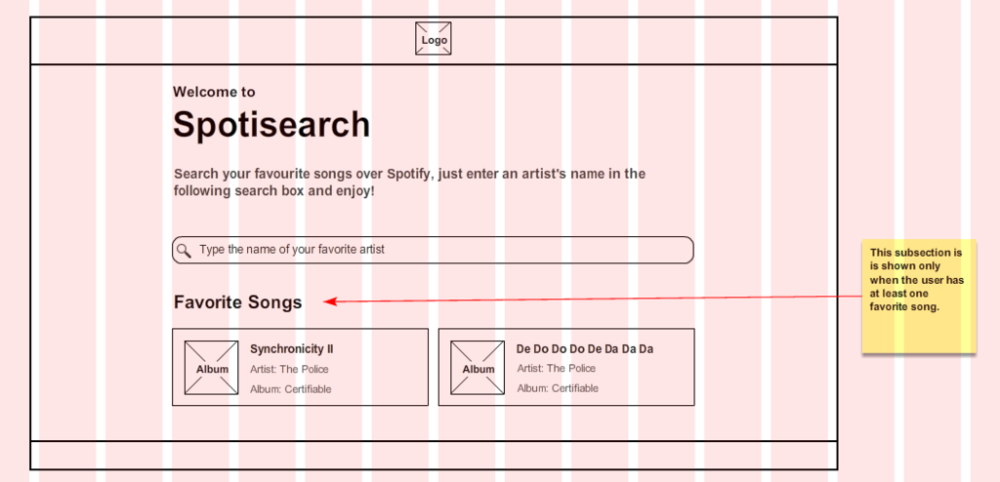
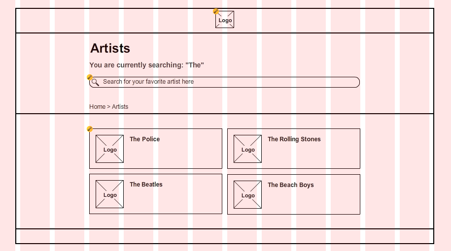
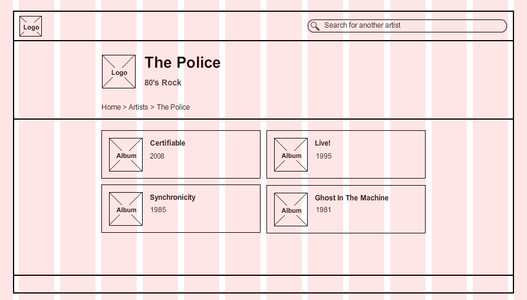
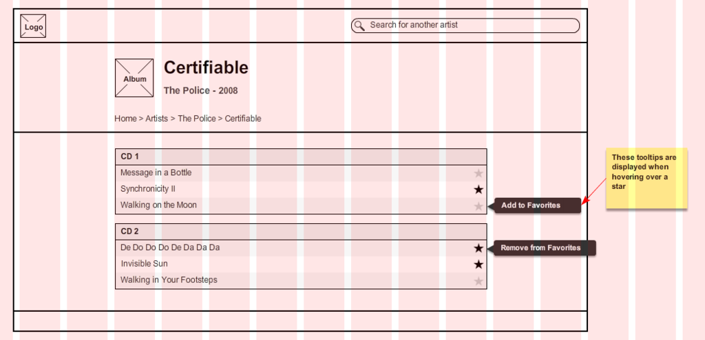
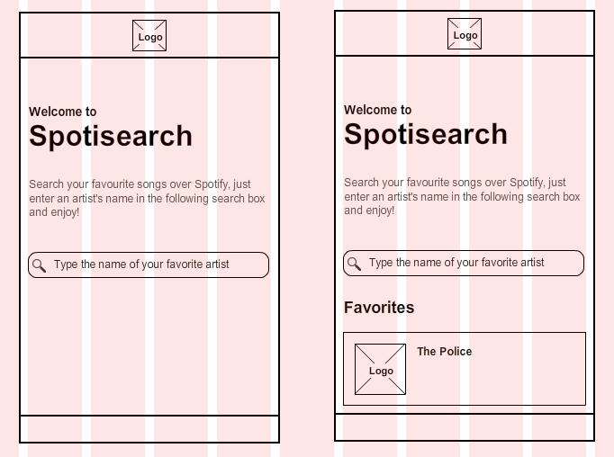
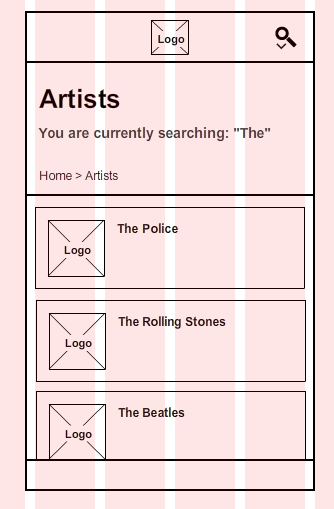
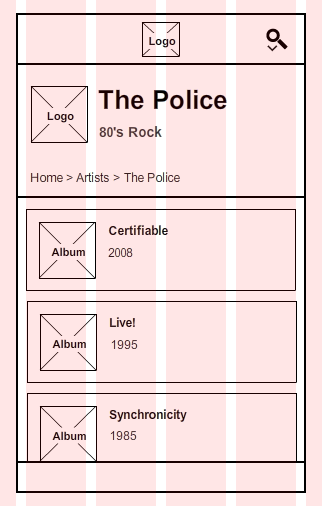
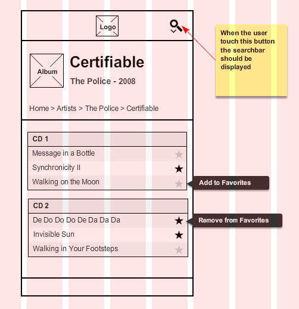
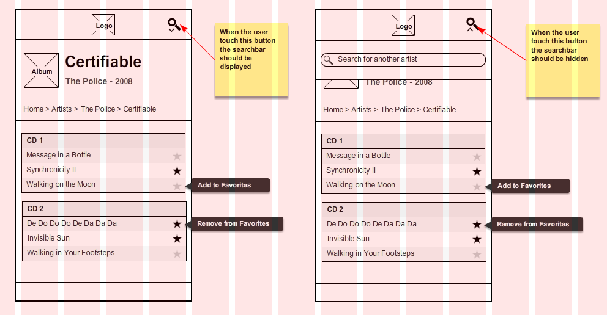

# React Bootcamp 2018 - Spotify Client

## Set up

1. Hacerse un fork.
2. Clonarselo.
3. En la consola:
    * Ir a la carpeta del proyecto nuevo: `cd react-final-project`.
    * Ejecutar el comando `npm install` para instalar las dependencias.
    * Ejecutar el comando `npm start` para iniciar la aplicación.
    * Enjoy!

## Introducción

Como usuario, quiero poder buscar un artista en spotify y ver sus álbumes y canciones. Además, quiero poder marcar mis canciones favoritas. (opcional)

## Objetivos

1. Crear una aplicación web que pueda ser accedida desde un teléfono y desde una máquina desktop.
   * Para probar la aplicación desde la vista de un teléfono, se recomienda usar las herramientas de emulación de dispositivos de [Google Chrome DevTools](https://developers.google.com/web/tools/chrome-devtools/device-mode/)

2. Obtener los resultados que coincidan con el texto ingresado, usando la API de búsqueda de spotify.

3. Poder marcar mis canciones favoritas y que al refrescar el navegador, sigan apareciendo como favoritas. (opcional)

## Requisitos Funcionales

### Necesarios

1. Como usuario, quiero poder buscar un artista en un formulario y ver el resultado de esa búsqueda.

2. Como usuario, quiero poder seleccionar entre los artistas que aparecieron en el resultado y luego ver un listado de sus álbumes.

3. Como usuario, quiero poder clickear en uno de sus álbumes y ver el nombre del álbum, una foto del álbum y el listado de canciones.

4. Como usuario quiero poder realizar una nueva búsqueda desde cualquier punto de mi aplicación.

5. Como usuario debo poder regresar a la página principal de mi aplicación en cualquier punto del flow.

6. Como usuario quiero poder escuchar un fragmento de cada tema.

### Opcionales

7. Como usuario quiero poder ordenar el listado de temas por duración de los mismos.

8. Como usuario, quiero poder refrescar la página con los resultados de mi búsqueda o el listado de álbumes o el listado de canciones, y quiero que se mantenga el estado.

9. Como usuario, quiero poder marcar una canción como favorita y al refrescar el navegador, quiero seguir viendo cómo favoritas las mismas canciones.

10. Las canciones marcadas como favoritas deben aparecer en una sección en la página principal.

## Spotify API

* Base url: [https://api.spotify.com/v1/](https://api.spotify.com/v1/)

* Lista de endpoints: [https://developer.spotify.com/web-api/endpoint-reference/](https://developer.spotify.com/web-api/endpoint-reference/)

### Ejemplo

Traer los datos de un álbum en base al id del album:

GET [https://api.spotify.com/v1/albums/10GYbpGRnCbUd5WsDzqHAv](https://api.spotify.com/v1/albums/10GYbpGRnCbUd5WsDzqHAv)

## Mockups

### Desktop

#### Home

#### Artists List

#### Artist

#### Album

### Mobile

#### Home

#### Artists List

#### Artist

#### Album

#### Search Bar

## Links útiles:

* [Create React App](https://github.com/facebookincubator/create-react-app)

* [React Router - Docs](https://reacttraining.com/react-router/)

* [Introducción a JSX](https://facebook.github.io/react/docs/introducing-jsx.html)

* [React LocalStorage](https://github.com/STRML/react-localstorage)

* [Presentational and Container Components](https://medium.com/@dan_abramov/smart-and-dumb-components-7ca2f9a7c7d0#.czw7rr9kf)

* [Egghead - Curso Básico de React](https://egghead.io/courses/react-fundamentals)
